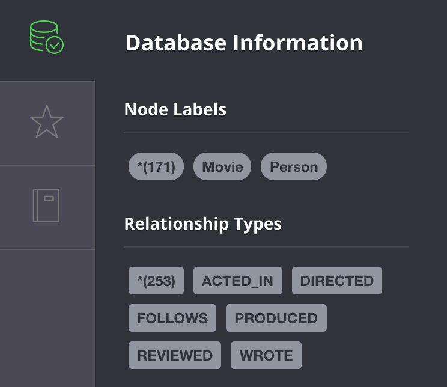
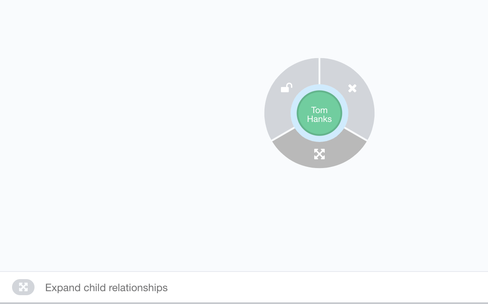
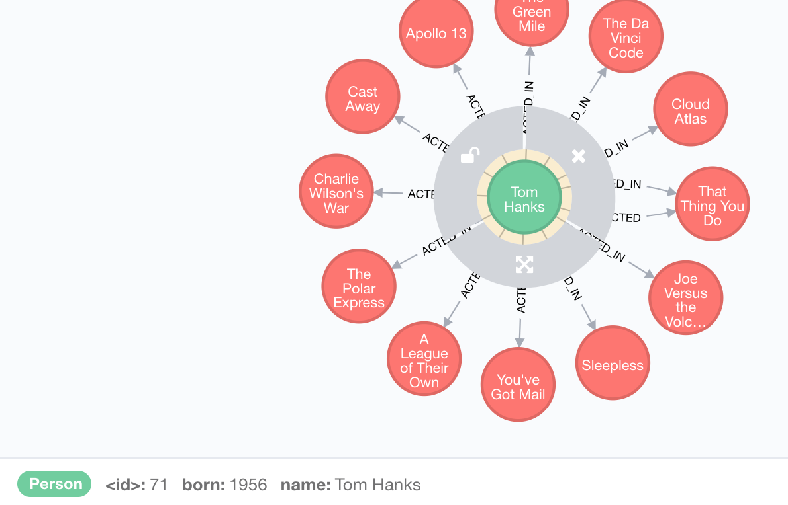

# README

## Goal

Print the names of co-stars in Tom Hanks movies to the command line via a Python script. You will be getting this data from a graph database (Neo4J) containing `Movie` and `Person` nodes with `ACTED_IN` relations.

You can write your script in *scripts/answer.py* and run it with `bin/run`.

Haven't used a graph database before? Great! Don't worry about understanding it fully. You'll need just enough to get what you need out of it.

## Rules

1. You can ask questions about anything at any time.

2. You can look up documentation or code snippets (or anything else) at any time from anywhere. We've included what we think will be the most helpful documentation above.

3. There are no real "tricks" to this. We want to see how you go about figuring out something new.

4. Feel free to talk out loud about what you're thinking, especially if you're getting stuck. It's totally okay to involve us in working through any of the problems.

5. Don't worry about making your code look nice. You shouldn't expect to have to write a lot of code, but what matters most is working code.

6. You have a maximum of 30 minutes to complete this before we go on with the interview. Let this be your guide for how much you should be involving us.

## Important Documentation

### Neo4J Cypher query language

Here's a crash course in Cypher, related to your problem. How do you find Tom Hanks?

```cypher
MATCH (tom:Person { name: 'Tom Hanks' })
RETURN tom
```

How would you list movies he's been in?

```cypher
MATCH (tom:Person { name: 'Tom Hanks' })-[:ACTED_IN]->(m:Movie)
RETURN m.title
```

The "MATCH" clause in Cypher is very pattern oriented. The parts between the `()` are nodes in your graph, and the parts between `[]` are relationships. You draw the pattern of nodes/relationships with `(a)-[r]->(b)`. You can read the above as: "Match a Person with the name 'Tom Hanks' and assign that to 'tom', follow the ACTED_IN relationship to any Movie and assign that to 'm'. Then return the title of every 'm' Movie you found."

Relationships can go in two directions, and you can specify more than one relationship in a single `MATCH` statement. For example `MATCH (a)-[:RELATIONSHIP]->(b)<-[:RELATIONSHIP]-(c)` is valid.

[Here's more comprehensive documentation on Cypher](https://neo4j.com/docs/developer-manual/current/cypher/) if you need to look up anything specific. But keep in mind that the 2nd query above is actually very close to what you need.

### Python Neo4J driver

You can find the original documentation for the neo4j Python driver [here](https://github.com/neo4j/neo4j-python-driver).

But it's more complex than what you'll need. Here is a simplified version of their "Quick Example" (note, you'll still have to make at least one change other than your query, as they assume your script accesses neo4j through 'localhost'):

```python
from neo4j import GraphDatabase

driver = GraphDatabase.driver("bolt://localhost:7687", auth=("neo4j", "password"))
results = driver.session().run('MATCH (n) ... RETURN ...')
for r in results:
    print(r['n.prop'])
```

### Docker

This exercise is running 2 Docker containers on the laptop: One for "neo4j" and one for the "app", which is where your script runs. We don't expect you to learn or know Docker as well in this exercise, but you should think of these 2 containers as if they're 2 separate servers.

We've pulled out the commands you'll need in Docker into scripts in the `bin` directory:

- `bin/run` to run your python script, located in *scripts/answer.py*. Right now, it just says 'hello world'
- `bin/rebuild-app` to rebuild the application container (you may find you need to install a library)
- `bin/python-console` and `bin/bash-console`: Depending on how you like to work (if you want to test commands or code snippets), these may be useful. But you can also just re-run the first 2 commands to test changes.

## Other helpful information

### Neo4J login credentials

Username: neo4j
Password: password

### Testing Cypher Queries

Neo4J has a browser based query interface at [http://localhost:7474](http://localhost:7474) that you can use to test out your query.

The browser itself contains some useful information:



And it can help you visualize and explore the graph while tuning a query:



Clicking the expand icon gives you:



### Dockerfiles

Dockerfiles specify steps for building a container. You may need to edit one. The app's Dockerfile is in *setup/app/Dockerfile* and neo4j's is in *setup/neo4j/Dockerfile*.

### Networking with Docker

Within the Docker containers, other services will be available by using their service name as a hostname. For example, `bolt://neo4j` will be allow you to access `neo4j` from the `app` container via the "bolt" protocol.

## For interviewers

This should be run and working before the interview:

```bash
bin/setup
```

Make sure to run this command after the interview:

```bash
bin/teardown
```

(Empty the Trash and clear your browser cache)
